hw4_regression-classification_trees
================
Cary Ni

## Problem 1

``` r
# load dataset
college_df = read_csv("College.csv", show_col_types = FALSE) %>% 
  janitor::clean_names() %>% 
  select(-college) %>% 
  na.omit()

# data partition
set.seed(2023)
index_train = createDataPartition(y = college_df$outstate, p = 0.8, list = FALSE)
```

### Recursive Partitioning and Regression Trees

``` r
# set train method
ctrl_1 = trainControl(method = "cv", number = 10)
set.seed(1)
rpart_model = train(outstate ~ . ,
                   data = college_df,
                   subset = index_train,
                   method = "rpart",
                   tuneGrid = data.frame(cp = exp(seq(-6,-2, length = 50))),
                   trControl = ctrl_1)
ggplot(rpart_model, highlight = TRUE)
```

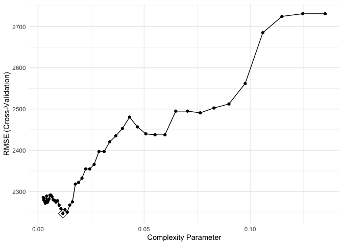<!-- -->

``` r
# Create a plot of the selected tree
rpart.plot(rpart_model$finalModel)
```

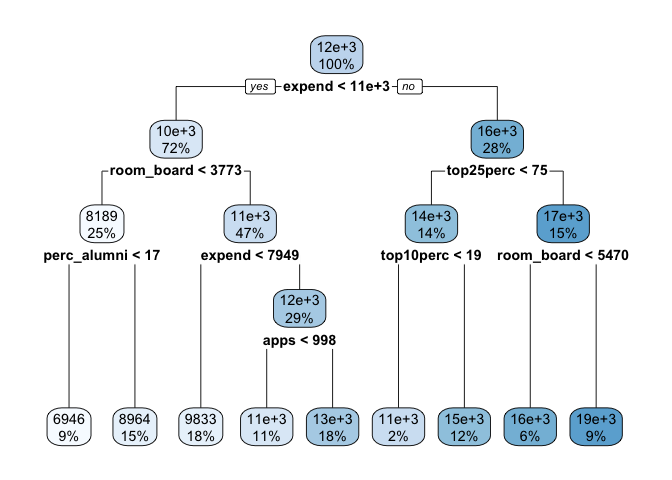<!-- -->

### Random Forest Regression

``` r
# For number of predictors included in each tree, p/3 and sqrt{p} are commonly selected. For 17 predictors in this model, the tunning range of mtry will be 3:9, which includes the values above. Min.node size will be 2:6 considering the small number of observations. 
set.seed(1)
rf_grid = expand.grid(mtry = 3:9,
                       splitrule = "variance",
                       min.node.size = 2:6)
rf_model = train(outstate ~ . ,
               data = college_df[index_train,],
               method = "ranger",
               tuneGrid = rf_grid,
               trControl = ctrl_1)
ggplot(rf_model, highlight = TRUE)
```

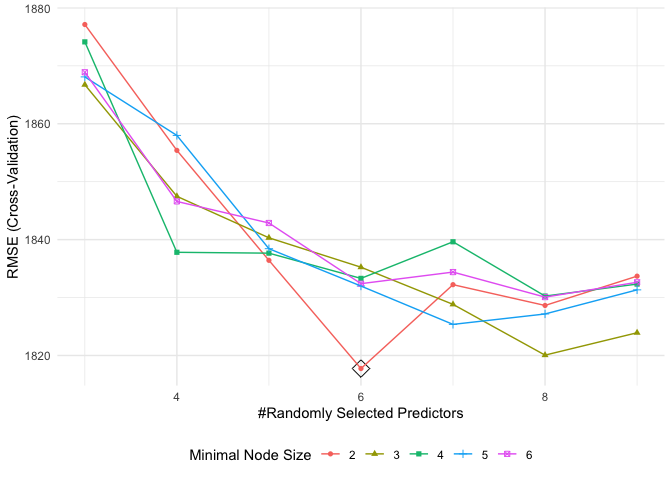<!-- -->

#### Variable importance and test MSE of Random Forest

``` r
set.seed(1)
rf_model_final = ranger(outstate ~ . ,
                        data = college_df[index_train,],
                        mtry = rf_model$bestTune[[1]],
                        splitrule = "variance",
                        min.node.size = rf_model$bestTune[[3]],
                        importance = "impurity")
barplot(sort(ranger::importance(rf_model_final), decreasing = FALSE),
        las = 2, horiz = TRUE, cex.names = 0.7,
        col = colorRampPalette(colors = c("cyan","blue"))(16))
```

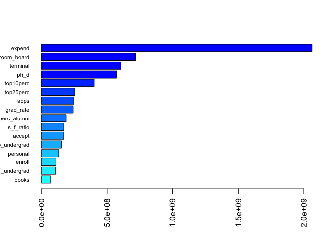<!-- -->

``` r
# test mse of final model from ranger 
pred_y = predict(rf_model_final, college_df[-index_train,])
mean((college_df[-index_train,]$outstate-pred_y$predictions)^2)
```

    ## [1] 2090869

``` r
# OR test mse of final model from caret 
# pred_z = predict(rf_model, college_df[-index_train,])
# mean((college_df[-index_train,]$outstate-pred_z)^2)
```

`expend` is the most important variable which accounts most reduction to
the loss function given this set of predictors. `room_board`,
`terminal`, and `ph_d` are followed. The test MSE is 2090869.

### Gradient Boosting regression

``` r
set.seed(1)
# learning rate selection criterion : max(0.01, 0.1*(min(1, nl/10000)))
gbm_grid = expand.grid(n.trees = c(seq(200, 1200, by = 100)),
                       interaction.depth = 1:3,
                       shrinkage = 0.01,
                       n.minobsinnode = c(3,5))
gbm_model = train(outstate ~ . ,
                  data = college_df[index_train,],
                  method = "gbm",
                  trControl = ctrl_1,
                  tuneGrid = gbm_grid,
                  verbose = FALSE)
ggplot(gbm_model, highlight = TRUE)
```

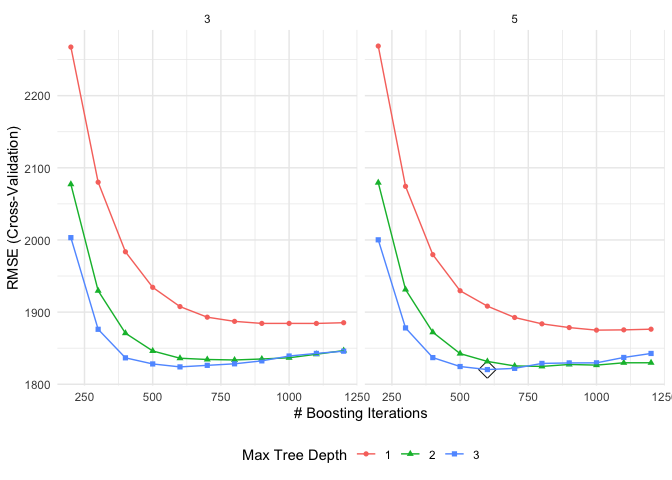<!-- -->

#### Variable importance and test MSE of Boosting Model

``` r
var_df = summary(gbm_model$finalModel, las = 2, cBars = 16, cex.names = 0.6)
```

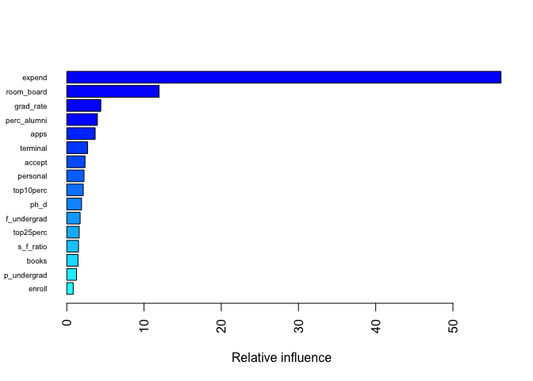<!-- -->

``` r
var_df %>% 
  as.data.frame() %>% 
  select(-var) %>% 
  knitr::kable()
```

|             |    rel.inf |
|:------------|-----------:|
| expend      | 56.2293479 |
| room_board  | 11.9594374 |
| grad_rate   |  4.4057356 |
| perc_alumni |  3.9678975 |
| apps        |  3.6780434 |
| terminal    |  2.6908159 |
| accept      |  2.3637394 |
| personal    |  2.2336687 |
| top10perc   |  2.1375602 |
| ph_d        |  1.9150704 |
| f_undergrad |  1.7312571 |
| top25perc   |  1.6123081 |
| s_f\_ratio  |  1.5213065 |
| books       |  1.4536362 |
| p_undergrad |  1.2658496 |
| enroll      |  0.8343261 |

``` r
# test mse of final model from caret 
pred_z = predict(gbm_model, college_df[-index_train,])
mean((college_df[-index_train,]$outstate-pred_z)^2)
```

    ## [1] 1827409

`expend` and `room_board` are the most important variable which accounts
for more than 56% and 12% of the reduction to the loss function given
this set of predictors. The test MSE is 1827409.

## Problem 2

### Classification Trees

``` r
data(OJ)
oj_df = OJ %>% janitor::clean_names()
set.seed(2022)
train_index = createDataPartition(oj_df$purchase, p = 700/1070, list = FALSE)

set.seed(3)
tree1 = rpart(purchase ~ . ,
              data = oj_df,
              subset = train_index,
              control = rpart.control(cp = 0))
cpTable = printcp(tree1)
```

    ## 
    ## Classification tree:
    ## rpart(formula = purchase ~ ., data = oj_df, subset = train_index, 
    ##     control = rpart.control(cp = 0))
    ## 
    ## Variables actually used in tree construction:
    ## [1] list_price_diff loyal_ch        price_diff      sale_price_mm  
    ## [5] special_ch      special_mm      store           weekof_purchase
    ## 
    ## Root node error: 273/701 = 0.38944
    ## 
    ## n= 701 
    ## 
    ##          CP nsplit rel error  xerror     xstd
    ## 1 0.5054945      0   1.00000 1.00000 0.047291
    ## 2 0.0158730      1   0.49451 0.50549 0.038563
    ## 3 0.0085470      4   0.44689 0.50183 0.038457
    ## 4 0.0073260      7   0.42125 0.52747 0.039182
    ## 5 0.0054945     10   0.39927 0.52747 0.039182
    ## 6 0.0036630     12   0.38828 0.53114 0.039283
    ## 7 0.0000000     17   0.36996 0.54579 0.039677

``` r
# cv error
plotcp(tree1)
```

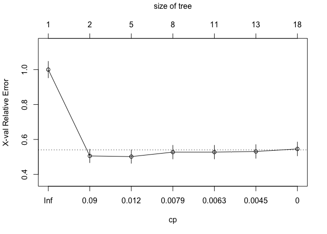<!-- -->

``` r
# tree size based on minimum cross-validation error
minErr = which.min(cpTable[,4])
tree2 = prune(tree1, cp = cpTable[minErr,1])
rpart.plot(tree2)
```

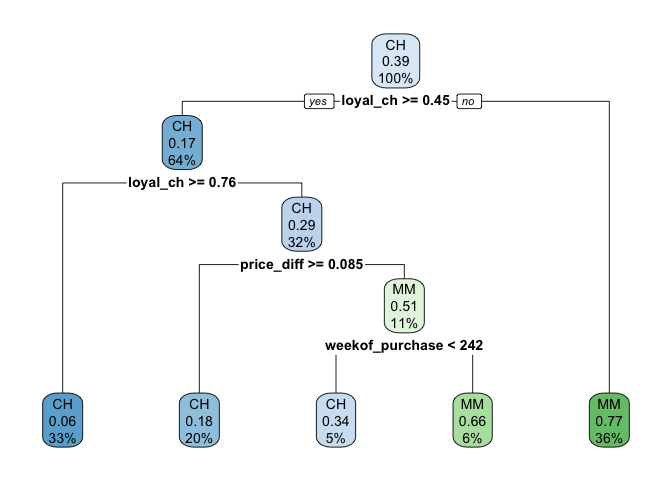<!-- -->

``` r
# tree size based on 1SE rule
tree4 = prune(tree1, cp = cpTable[cpTable[,4]< cpTable[minErr,4]+cpTable[minErr,5],1][1])
rpart.plot(tree4)
```

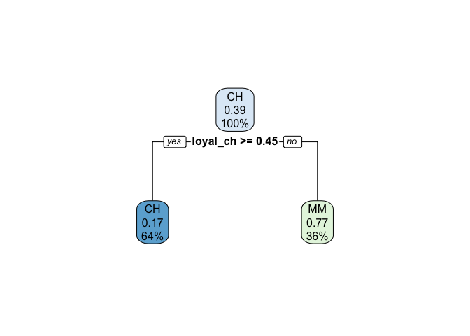<!-- -->

1)  The tree with lowest cross-validation error has a size of 5, which
    is different from the tree size of 2 based on the selection of 1 SE
    rule.

### Adaptive boosting classfier

``` r
ctrl_2 = trainControl(method = "cv",
                     classProbs = TRUE,
                     summaryFunction = twoClassSummary)
# set tunning parameters
# learning rate selection criterion : max(0.01, 0.1*(min(1, nl/10000)))
gbmA_grid <- expand.grid(n.trees = c(seq(200, 1200, by = 100)),
                         interaction.depth = 1:3,
                         shrinkage = 0.01,
                         n.minobsinnode = c(3, 5))
set.seed(5)
gbmA_model = train(purchase ~ . ,
                  data = oj_df,
                  subset = train_index,
                  tuneGrid = gbmA_grid,
                  trControl = ctrl_2,
                  method = "gbm",
                  distribution = "adaboost",
                  metric = "ROC",
                  verbose = FALSE)
ggplot(gbmA_model, highlight = TRUE)
```

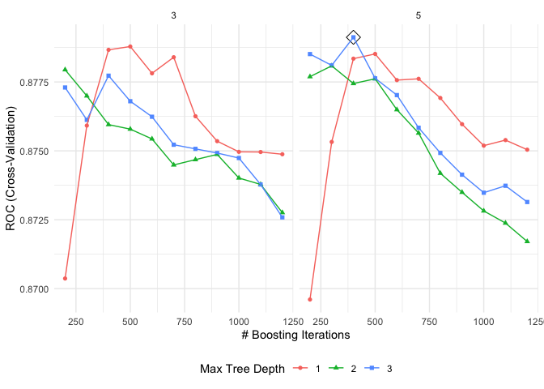<!-- -->

#### Variable importance of Adaptive boosting classfier

``` r
# show relative importance of 10 most important variables
var_df_2 = summary(gbmA_model$finalModel, las = 2, cBars = 10, cex.names = 0.6)
```

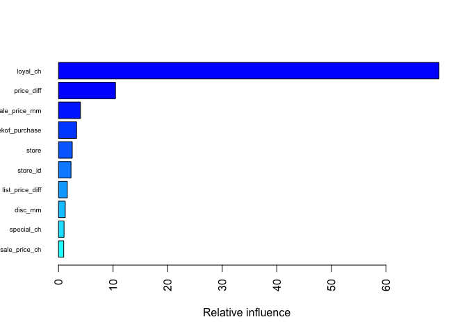<!-- -->

``` r
var_df_2 %>% 
  as.data.frame() %>% 
  select(-var) %>% 
  knitr::kable()
```

|                 |    rel.inf |
|:----------------|-----------:|
| loyal_ch        | 69.7231932 |
| price_diff      | 10.4413927 |
| sale_price_mm   |  4.0231151 |
| weekof_purchase |  3.3112194 |
| store           |  2.5199953 |
| store_id        |  2.2890655 |
| list_price_diff |  1.6142087 |
| disc_mm         |  1.2340747 |
| special_ch      |  1.0129561 |
| sale_price_ch   |  0.9545172 |
| price_mm        |  0.8461131 |
| pct_disc_mm     |  0.5225001 |
| price_ch        |  0.4238247 |
| disc_ch         |  0.3919234 |
| pct_disc_ch     |  0.2632321 |
| store7Yes       |  0.2207418 |
| special_mm      |  0.2079269 |

#### Test error rate of Adaptive boosting classfier

``` r
postResample(predict(gbmA_model, oj_df[-train_index,]),
             oj_df[-train_index,]$purchase) %>% knitr::kable()
```

|          |         x |
|:---------|----------:|
| Accuracy | 0.8672087 |
| Kappa    | 0.7185092 |

2)  The test error rate is given by (1 - accuracy) which is 0.133 for
    this adaptive boosting classfier.
